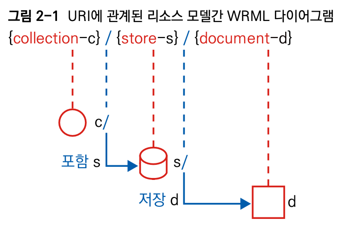

# 2.6 URI 경로 디자인

슬래시(/)로 구분된 각 URI 경로 부분은 다양한 형태로 설계할 수 있다. URI 경로 각 부분에 의미 있는 값들을 줌으로써 REST API 리소스 모델 디자인의 계층적 구조를 분명하게 표현할 수 있다.

그림 2-1은 WRML 표기법을 사용하여, URI 경로 설계와 이를 통해 표현하려는 리소스 모델의 관계를 나타낸 것이다.

<figure><figcaption>
그림 2-1
</figcaption></figure>

이 부분에서는 URI 경로를 디자인할 수 있는 규칙을 설명한다.

[규칙: 도큐먼트 이름으로는 단수 명사를 사용해야 한다](undefined.md)

[규칙: 컬렉션 이름으로는 복수 명사를 사용해야 한다](undefined-1.md)

[규칙: 스토어 이름으로는 복수 명사를 사용해야 한다](undefined-2.md)

[규칙: 컨트롤러 이름으로는 동사나 동사구를 사용해야 한다](undefined-3.md)

[규칙: 경로 부분 중 변하는 부분은 유일한 값으로 대체한다](undefined-4.md)

[규칙: CRUD 기능을 나타내는 것은 URI에 사용하지 않는다](crud-uri.md)
